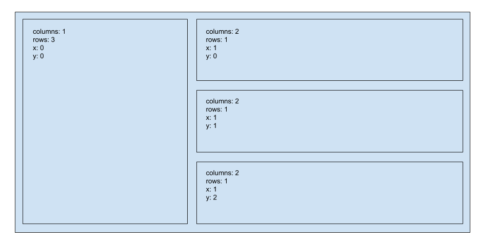

# Dashboard Layout

Vida uses a grid layout for dashboards. The grid is divided into rows and columns. For each chart, you can specify the number of columns and rows that the chart occupies. Then, you can specify the position x (horizontal) and y (vertical). x and y positions start from 0.

Here's an example layout:



In this example, the dashboard has 3 columns and 3 rows. It contains 4 charts. The JSON file for this dashboard would contain the below positions.

```json
{
  "columns": 3,
  "rows": 3,
  "charts": [
    {
      "title": "chart 1",
      "position": {
        "columns": 1,
        "rows": 3,
        "x": 0,
        "y": 0
      }
    },
    {
      "name": "chart 2",
      "position": {
        "columns": 2,
        "rows": 1,
        "x": 1,
        "y": 0
      }
    },
    {
      "name": "chart 3",
      "position": {
        "columns": 2,
        "rows": 1,
        "x": 1,
        "y": 1
      }
    },
    {
      "name": "chart 3",
      "position": {
        "columns": 2,
        "rows": 1,
        "x": 1,
        "y": 2
      }
    }
  ]
}
```